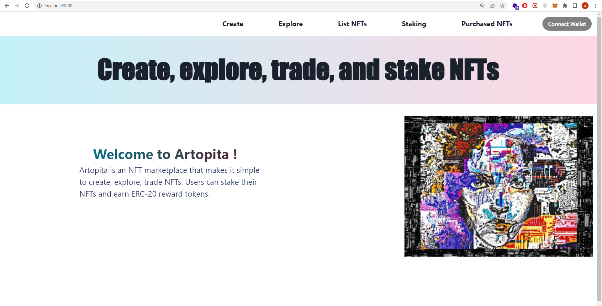

It is my first big project. It is an NFT marketplace called "Artopita" that users can:
- Create and mint their own NFTS.
- List their NFTS on the marketplace (explore page). 
- Trade (buy and sell) NFTS.
- List any NFTS they own by providing the nft contract address and the token id that they own.
- Stake their NFT and earn a reward ERC20 tokens.

I deployed the smart contracts on remix to be easy to use the ganache accounts for testing.
Solidity codes on the solidity projects repository [NFT marketplace solidity code](https://github.com/Eidoox/Smart-contracts-solidity-projects/tree/main/NFT%20Marketplace)
 
