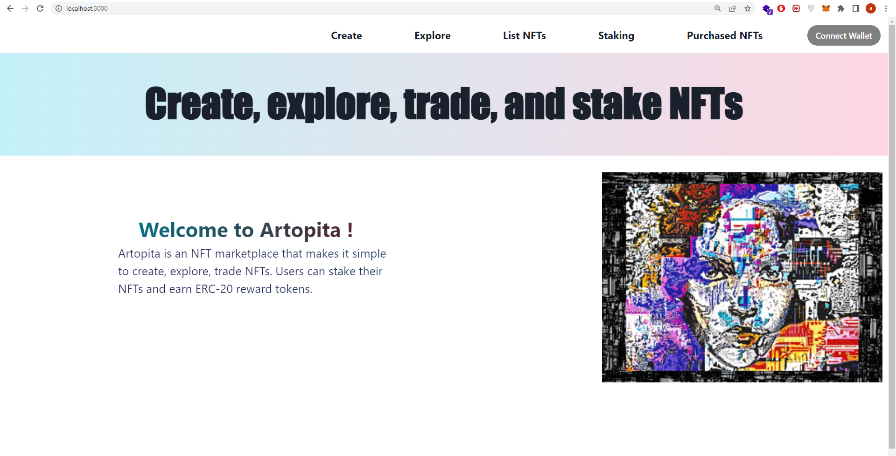

It is my first big project. It is an NFT marketplace called "Artopita" that users can:
- Create and mint their own NFTS.
- List their NFTS on the marketplace (explore page). Users can trade (buy and sell) NFTS.
- List any NFTS they own by providing the nft contract address and the token id that this user owns.
- Stake their NFT and earn a reward ERC20 tokens.

